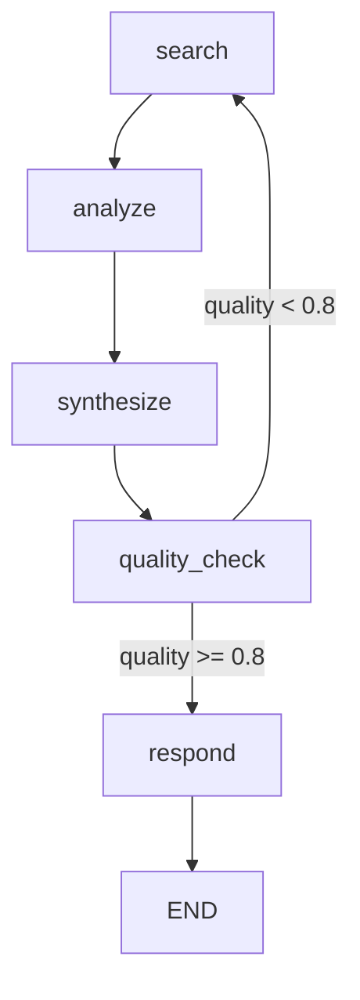

# Lesson: LangGraph for Complex Agent Workflows

## Overview

In this lesson, you'll learn how to use LangGraph to build sophisticated agent workflows with state management, conditional branching, and cycles. LangGraph enables patterns that simple prompt chains can't achieve.

**Duration**: 25 minutes  
**Prerequisites**: Module 3 Lesson 1-2 (Agent Fundamentals, Tool Design)

## Learning Objectives

By the end of this lesson, you will:
- Understand LangGraph's graph-based execution model
- Create stateful agent workflows
- Implement conditional branching and loops
- Add human-in-the-loop checkpoints
- Handle errors and recovery in graph workflows

---

## Why LangGraph?

Standard agent loops have limitations:

```python
# Simple loop - limited control flow
while not done:
    action = llm.decide(state)
    result = execute(action)
    if action == "finish":
        done = True
```

LangGraph enables:
- **Conditional branching**: Different paths based on state
- **Cycles**: Return to previous steps
- **State persistence**: Save and resume workflows
- **Human checkpoints**: Pause for approval
- **Parallel execution**: Run multiple branches

---

## Core Concepts

### 1. State

State flows through the graph, updated by each node.

```python
from typing import TypedDict, Annotated
from langgraph.graph.message import add_messages

class AgentState(TypedDict):
    """State passed between nodes."""
    messages: Annotated[list, add_messages]
    current_step: str
    data: dict
    attempts: int
```

### 2. Nodes

Nodes are functions that process state.

```python
def research_node(state: AgentState) -> AgentState:
    """Research information based on the query."""
    query = state["messages"][-1].content
    
    # Perform research
    results = search_knowledge_base(query)
    
    return {
        "messages": [AIMessage(content=f"Found: {results}")],
        "current_step": "analyze",
        "data": {"search_results": results}
    }
```

### 3. Edges

Edges connect nodes, determining flow.

```python
# Simple edge
graph.add_edge("research", "analyze")

# Conditional edge
graph.add_conditional_edges(
    "analyze",
    should_continue,  # Function that returns next node name
    {
        "continue": "research",
        "finish": "respond"
    }
)
```

---

## Building a Research Agent

### Step 1: Define State

```python
from typing import TypedDict, Annotated, Literal
from langgraph.graph.message import add_messages
from langchain_core.messages import HumanMessage, AIMessage, SystemMessage

class ResearchState(TypedDict):
    messages: Annotated[list, add_messages]
    query: str
    sources: list[dict]
    synthesis: str
    iterations: int
    quality_score: float
```

### Step 2: Create Nodes

```python
from langchain_openai import ChatOpenAI
from langchain_core.tools import tool

llm = ChatOpenAI(model="gpt-4o-mini")

def search_node(state: ResearchState) -> ResearchState:
    """Search for information."""
    query = state["query"]
    
    # Search multiple sources
    web_results = search_web(query)
    doc_results = search_docs(query)
    
    sources = web_results + doc_results
    
    return {
        "sources": sources,
        "messages": [AIMessage(content=f"Found {len(sources)} sources")]
    }


def analyze_node(state: ResearchState) -> ResearchState:
    """Analyze search results."""
    sources = state["sources"]
    query = state["query"]
    
    # Ask LLM to analyze
    prompt = f"""
    Query: {query}
    
    Sources:
    {format_sources(sources)}
    
    Analyze these sources and identify:
    1. Key findings
    2. Conflicting information
    3. Gaps that need more research
    
    Respond in JSON: {{"findings": [], "conflicts": [], "gaps": []}}
    """
    
    response = llm.invoke(prompt)
    analysis = json.loads(response.content)
    
    return {
        "data": {"analysis": analysis},
        "messages": [AIMessage(content=f"Analysis complete. Found {len(analysis['gaps'])} gaps.")]
    }


def synthesize_node(state: ResearchState) -> ResearchState:
    """Synthesize final answer."""
    query = state["query"]
    sources = state["sources"]
    analysis = state.get("data", {}).get("analysis", {})
    
    prompt = f"""
    Query: {query}
    
    Sources: {format_sources(sources)}
    Analysis: {json.dumps(analysis)}
    
    Write a comprehensive answer to the query, citing sources.
    """
    
    response = llm.invoke(prompt)
    
    return {
        "synthesis": response.content,
        "messages": [AIMessage(content="Synthesis complete.")]
    }


def quality_check_node(state: ResearchState) -> ResearchState:
    """Check answer quality."""
    synthesis = state["synthesis"]
    query = state["query"]
    
    prompt = f"""
    Query: {query}
    Answer: {synthesis}
    
    Rate the answer quality (0-1) based on:
    - Completeness
    - Accuracy
    - Citation of sources
    
    Respond with just a number.
    """
    
    response = llm.invoke(prompt)
    score = float(response.content.strip())
    
    return {
        "quality_score": score,
        "iterations": state.get("iterations", 0) + 1
    }
```

### Step 3: Define Routing

```python
def should_continue(state: ResearchState) -> Literal["search", "respond"]:
    """Decide whether to continue researching or respond."""
    
    quality = state.get("quality_score", 0)
    iterations = state.get("iterations", 0)
    
    # Good enough or max iterations reached
    if quality >= 0.8 or iterations >= 3:
        return "respond"
    
    # Need more research
    return "search"
```

### Step 4: Build the Graph

```python
from langgraph.graph import StateGraph, END

# Create graph
workflow = StateGraph(ResearchState)

# Add nodes
workflow.add_node("search", search_node)
workflow.add_node("analyze", analyze_node)
workflow.add_node("synthesize", synthesize_node)
workflow.add_node("quality_check", quality_check_node)
workflow.add_node("respond", lambda s: s)  # Final node

# Add edges
workflow.add_edge("search", "analyze")
workflow.add_edge("analyze", "synthesize")
workflow.add_edge("synthesize", "quality_check")

# Conditional edge - continue or finish
workflow.add_conditional_edges(
    "quality_check",
    should_continue,
    {
        "search": "search",
        "respond": "respond"
    }
)

# Terminal edge
workflow.add_edge("respond", END)

# Set entry point
workflow.set_entry_point("search")

# Compile
app = workflow.compile()
```

### Step 5: Run the Agent

```python
# Execute
result = app.invoke({
    "query": "What are best practices for fine-tuning LLMs?",
    "messages": [],
    "sources": [],
    "synthesis": "",
    "iterations": 0,
    "quality_score": 0.0
})

print(result["synthesis"])
```

---

## Human-in-the-Loop

Add approval checkpoints for sensitive actions:

```python
from langgraph.checkpoint import MemorySaver

# Add checkpoint memory
memory = MemorySaver()

# Define approval node
def request_approval(state: ResearchState) -> ResearchState:
    """Request human approval before proceeding."""
    return {
        "messages": [AIMessage(
            content=f"Approval required for: {state['pending_action']}"
        )]
    }

# Build graph with checkpointer
app = workflow.compile(
    checkpointer=memory,
    interrupt_before=["execute_action"]  # Pause before this node
)

# Run until checkpoint
config = {"configurable": {"thread_id": "research-123"}}
result = app.invoke(initial_state, config)

# Resume after approval
app.update_state(config, {"approved": True})
final = app.invoke(None, config)
```

---

## Error Handling

Handle failures gracefully:

```python
def resilient_search(state: ResearchState) -> ResearchState:
    """Search with error handling."""
    try:
        results = search_api(state["query"])
        return {
            "sources": results,
            "error": None
        }
    except APIError as e:
        return {
            "sources": [],
            "error": str(e),
            "messages": [AIMessage(content=f"Search failed: {e}. Trying backup.")]
        }


def route_after_search(state: ResearchState) -> str:
    """Route based on search success."""
    if state.get("error"):
        return "backup_search"
    return "analyze"


# Add conditional routing
workflow.add_conditional_edges(
    "search",
    route_after_search,
    {
        "backup_search": "backup_search",
        "analyze": "analyze"
    }
)
```

---

## Visualization

LangGraph provides built-in visualization:

```python
# Generate graph diagram
graph_png = app.get_graph().draw_mermaid_png()

# Or as mermaid code
mermaid_code = app.get_graph().draw_mermaid()
print(mermaid_code)
```

Output:


---

## Best Practices

### 1. Clear State Design
```python
# Good: Typed, documented state
class MyState(TypedDict):
    """Agent state for customer support."""
    customer_id: str
    issue_category: str
    resolved: bool
    actions_taken: list[str]
```

### 2. Focused Nodes
```python
# Good: Single responsibility
def validate_input_node(state): ...
def lookup_customer_node(state): ...
def generate_response_node(state): ...

# Bad: Everything in one node
def do_everything_node(state): ...
```

### 3. Explicit Routing
```python
# Good: Clear conditions
def route_decision(state) -> str:
    if state["needs_escalation"]:
        return "escalate"
    if state["can_auto_resolve"]:
        return "resolve"
    return "human_review"
```

---

## Key Takeaways

1. **LangGraph enables complex workflows** with branching, loops, and state
2. **State is central**: Design clear, typed state for your workflow
3. **Nodes do one thing**: Keep nodes focused and testable
4. **Conditional edges** enable dynamic routing based on state
5. **Checkpoints** allow human approval and workflow persistence
6. **Error handling** should be built into your graph structure

---

## Next Steps

- **Lab**: Build a ReAct agent with LangGraph
- **Next Lesson**: Multi-agent systems with CrewAI
- **Advanced**: Streaming and real-time updates in LangGraph
